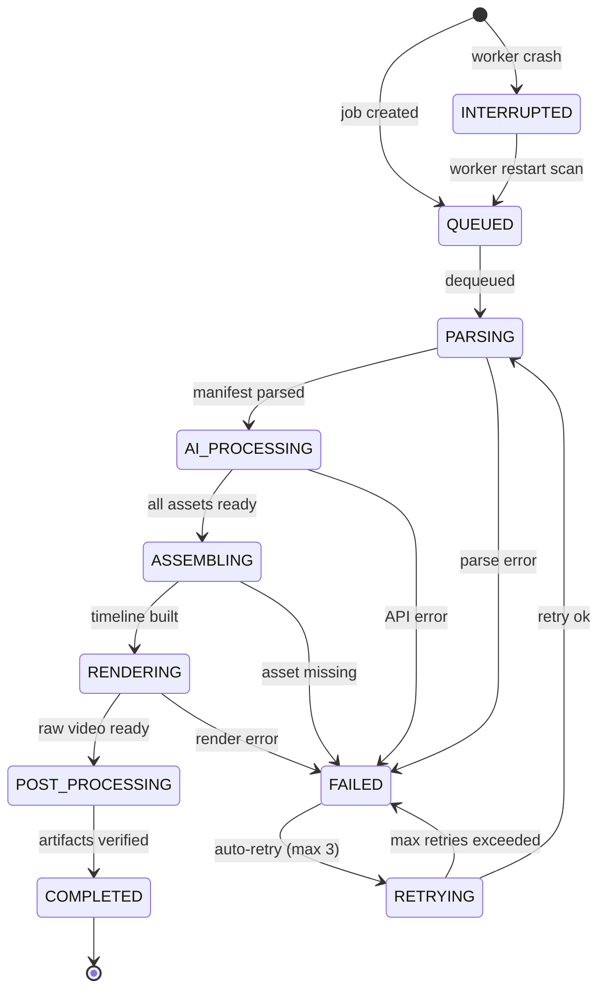

# video-ops PRD v1.0

> **文档状态**：已拍板（开放决策项 7/7 已确认，2026-06-22）
> **最后更新**：2026-06-22（Q1-Q7 拍板 + 文档状态更新）
> **维护者**：John

---

## 1. 产品概述

**产品名称**：video-ops（AI 图文短视频自动混剪系统）

**核心价值主张**：让内容创作者通过一份文案（Markdown/JSON）自动生成可发布的短视频（.mp4），输出到抖音 / 小红书 / 视频号。

**目标用户**：需要日更 / 周更短视频的自媒体创作者（个人 IP、企业号矩阵）。

**与 ContentOps 的关系**：ContentOps 负责图文内容（公众号 / 小红书图文），video-ops 负责视频内容（抖音 / 小红书视频 / 视频号），两者共享 LLM Gateway 作为 AI 调用层。

---

## 2. 用户故事

### 2.1 核心用户故事

| ID | 角色 | 我想要... | 以便于... | 优先级 |
|----|------|---------|---------|--------|
| US-1 | 内容创作者 | 输入一段文案，自动生成配套图片 | 不需要手动找图 / 作图 | P0 |
| US-2 | 内容创作者 | 输入文案后自动生成配音 | 不需要自己录音 | P0 |
| US-3 | 内容创作者 | 选择目标平台，一键输出适配的 MP4 | 直接发布，不需要格式转换 | P0 |
| US-4 | 内容创作者 | 查看任务进度（实时 SSE 推送）| 知道渲染还需要多久 | P0 |
| US-5 | 内容创作者 | 任务中断后从断点续跑 | 不重复等待已完成的步骤 | P1 |
| US-6 | 内容创作者 | 预览最终效果后再决定是否渲染 | 避免浪费算力渲染错误内容 | P1 |
| US-7 | 开发者 | 看到每个任务的成本估算 | 控制 API 花费 | P1 |
| US-8 | 开发者 | 导出一个合规报告 | 证明 AI 生成内容的来源 | P2 |

### 2.2 用户交互流程

```
用户粘贴文案
    ↓
配置视频规格（平台 / 时长 / 分辨率）
    ↓
AI 自动处理（文案解析 → 图片生成 → TTS 配音 → 组装 → 渲染）
    ↓
预览 Storyboard（可选调整）
    ↓
导出 MP4 + 封面 + 元数据
```

---

## 3. 视频规格矩阵

### 3.1 默认规格

| 参数 | 默认值 | 可选范围 |
|------|--------|---------|
| 分辨率 | 1080x1920（竖屏 9:16）| 720x1280 / 1080x1920 / 1920x1080（横屏 16:9）|
| 时长 | 30s | 15s / 30s / 60s / 任意 |
| 帧率 | 30 FPS | 24 / 30 / 60 |
| 编码 | H.264 | H.264 / H.265 |
| 码率 | 8 Mbps | 4 / 8 / 12 Mbps |

### 3.2 多平台规格

| 平台 | 最大时长 | 文件大小上限 | 封面要求 | 推荐分辨率 |
|------|---------|------------|---------|---------|
| 抖音 | 15 分钟 | <100MB（建议）| 首帧或单独上传 | 1080x1920 |
| 小红书 | 5 分钟 | <500MB | 必须单独上传封面 | 1080x1440（3:4）或 1080x1920 |
| 视频号 | 30 分钟 | <1GB（建议）| 静态封面 1080x1260 | 1080x1920 |

> 数据来源：抖音开放平台 / 小红书创作者平台 / 微信视频号官方文档（2026-06 验证）

---

## 4. 技术选型（已确认）

| 维度 | 选型 | 说明 |
|------|------|------|
| 形态 | 本地 Web 平台（Next.js）| 与 ContentOps 架构一致 |
| 语言 | TypeScript + Python | Next.js 前端 + Python Worker |
| 数据库 | Prisma + PostgreSQL | 本地 Docker 开发，SaaS 迁移仅改 datasource url |
| 任务队列 | BullMQ + Redis | 必须（渲染分钟级，不能同步阻塞）|
| 图片生成 | GPT Image 2 + wanx-v1（异步 X-Dashscope-Async）| 经 LLM Gateway（PackyCode）调用 |
| TTS | CosyVoice 3.0 MLX（mlx-audio）| 本地 M4 推理，支持零样本音色克隆 |
| 字幕 | mlx-audio Whisper STT | 同 mlx-audio 库，TTS/STT 一套 |
| 视频渲染 | FFmpeg + MoviePy | 本地 M4，不依赖 GPU |
| ORM | Prisma（与 ContentOps 的 Drizzle 不同）| Prisma Schema 管理数据库 |
| 进度推送 | SSE + WebSocket Fallback | 实时进度，Worker 崩溃可重连 |

### 4.1 CosyVoice 3.0 MLX 技术参数

| 指标 | 数值 |
|------|------|
| 模型 | `aufklarer/CosyVoice3-0.5B-MLX-4bit` |
| 大小 | ~1.2 GB（4-bit 量化）|
| 内存推荐 | 16GB+ 统一内存（M2 Max 流畅）|
| 推理速度 | RTF ~0.5（M2 Max），快于实时 |
| 克隆方式 | 零样本，上传 3-10 秒参考音频 |
| 语言覆盖 | 9 种语言 + 18 种中文方言 |
| 延迟 | DiT ~370-520ms，HiFi-GAN ~50-170ms |
| 必需依赖 | FFmpeg（`brew install ffmpeg`），mlx-audio v0.4.4+ |

---

## 5. ContentManifest Schema

所有输入以 ContentManifest JSON 为入口标准。

```json
{
  "$schema": "https://video-ops.example.com/manifest-v1.schema.json",
  "id": "uuid-v4",
  "title": "视频标题（最多30字）",
  "platform": "douyin | xiaohongshu | videox",
  "renderProfile": "draft | standard | high_quality",
  "scenes": [
    {
      "id": "scene-001",
      "duration_ms": 5000,
      "narration": "口播文案（每句不超过30字）",
      "script_type": "narration | caption | dialogue",
      "mood": "inspiring | calm | exciting | humorous",
      "visual_hint": "可选：画面描述提示词",
      "audio": {
        "tts_voice": "zh-CN-female-yunyang",
        "bgm": "upbeat-lofi-001"
      }
    }
  ],
  "metadata": {
    "created_at": "ISO8601",
    "author": "creator-name",
    "copyright_license": "CC-BY-4.0 | commercial | internal"
  }
}
```

### 5.1 支持的输入格式

| 格式 | 解析方式 | 说明 |
|------|---------|------|
| ContentManifest JSON | 直接使用 | 标准入口格式 |
| Markdown | TextParser 解析 | 提取标题、段落、场景分割 |
| JSON | TextParser 适配 | 兼容旧版 ContentOps 格式 |
| TXT | TextParser 简化解析 | 纯文本逐句切割 |

---

## 6. SOP 全链路

### 6.1 Pipeline 总览

```
INPUT → DATA → PROCESS → OUTPUT

INPUT（文案 + 素材）
  ↓
P1 TextParser    → 解析 ContentManifest → SceneGraph
  ↓
P2 ImageGenerator → GPT Image 2 生成分镜图
  ↓
P3 BrollGenerator → wanx-v1 生成装饰图
  ↓
P4 TTSClient     → CosyVoice 3.0 MLX 配音合成
  ↓
P5 LipsyncEngine → 唇形同步（可选，Feature 2.3，延后）
  ↓
P6 VideoAssembler → 按时间线组装片段 + 转场
  ↓
P7 SubtitleGenerator → Whisper STT 字幕生成
  ↓
P8 AudioMixer    → 配音 + BGM 混音
  ↓
P9 Renderer      → FFmpeg 最终合成 MP4
  ↓
OUTPUT（MP4 + 封面 + 元数据 + 合规报告）
```

### 6.2 各步骤详情

| 步骤 | 模块 | 模型 | 输入 | 输出 |
|------|------|------|------|------|
| P1 | TextParser | — | ContentManifest | SceneGraph |
| P2 | ImageGenerator | GPT Image 2（Gateway）| SceneGraph.visual_hint | `assets/generated/*.png` |
| P3 | BrollGenerator | wanx-v1（Gateway，异步）| scene_id | `assets/generated/broll/*.png` |
| P4 | TTSClient | CosyVoice 3.0 MLX（本地）| SceneGraph.narration + 参考音频 | `assets/audio/narration.wav` |
| P5 | LipsyncEngine | — | TTS 音频 + AI 图片 | `assets/video/frames/`（延后）|
| P6 | VideoAssembler | — | SceneGraph + assets | `assets/video/assembled.mp4` |
| P7 | SubtitleGenerator | mlx-audio Whisper（本地）| narration audio | `assets/subtitles/*.srt` |
| P8 | AudioMixer | — | narration + BGM + SFX | `assets/audio/mixed.wav` |
| P9 | Renderer | — | assembled + mixed + subs | `output/*.mp4` |

### 6.3 SOP 关键规则

- 每个 P 模块完成后写入 `JobState`，支持断点续跑
- 任意 P 步骤失败，自动重试 3 次，间隔 5s / 15s / 60s
- 所有中间产物保留在 `assets/` 目录（便于排查问题）
- Prompt 注入 Sanitization：ContentManifest 进入 LLM 前必须经过 `sanitize_prompt()` 过滤
- AI 输出质量校验：图片亮度 / 尺寸检测 + 音频振幅 / 静音检测
- 中间产物缓存：按 `scene_hash + prompt_hash` 缓存已生成图片

---

## 7. JobState 状态机



---

## 8. 数据模型（Prisma Schema）

> Prisma Schema 是数据库持久化的唯一来源，SaaS 迁移仅改 `schema.prisma` 的 provider。

| 数据模型 | 职责 | Prisma 表 |
|---------|------|---------|
| ContentManifest | 内容入口清单 | ContentManifest |
| SceneGraph | 场景节点图 | Scene |
| AssetRegistry | 素材注册表 | Asset |
| RenderSpec | 渲染规格单 | RenderJob |
| JobState | 任务状态机 | Job |
| OutputBundle | 输出交付包 | Output |
| JobErrorLog | 重试错误日志 | JobErrorLog（新增）|

### 8.1 Job 表新增字段（v1 扩展）

```prisma
model Job {
  // ... existing fields
  lastCheckpoint      Json?    // 每个 P 模块完成状态（断点续跑）
  costEstimateUsd    Float?   @default(0)
  gptImageCalls      Int      @default(0)
  wanxCalls          Int      @default(0)
  ttsDurationSecs    Float    @default(0)
}
```

---

## 9. 可靠性设计

### 9.1 幂等性

创建任务时检查 `manifestHash + ownerToken`，若存在进行中任务则返回已有 job，不重复创建。

### 9.2 资源超载保护

| 限制 | 值 | 说明 |
|------|---|------|
| 最大并发渲染 | 2 | M4 内存限制 |
| 队列积压上限 | 50 | 超过暂停接受新任务 |
| 内存阈值 | 12 GB | 超过暂停新任务 |
| API 请求限流 | 20 req/min/IP | Upstash Redis Ratelimit |

### 9.3 质量门禁

| 校验项 | 失败条件 | 处理方式 |
|--------|---------|---------|
| 图片尺寸 | < 256px | 标记失败，重试 |
| 图片亮度 | mean < 5 或 > 250 | 标记失败，重试 |
| 音频振幅 | max < 0.01 | 标记静音失败，重试 |
| 音频时长 | < 0.5s | 标记失败，重试 |

---

## 10. 三档渲染 Profile

| Profile | 分辨率 | 码率 | 帧率 | 适用场景 |
|---------|-------|------|------|---------|
| draft | 720p | 4 Mbps | 24 | 快速预览，节省 API 调用 |
| standard | 1080p | 8 Mbps | 30 | 日常发布 |
| high_quality | 4K / 1080p | 12 Mbps | 60 | 重要内容 / 正式发布 |

---

## 11. 非目标（V1 明确不做）

以下功能延后到 v2，不在 Sprint 1-4 范围内：

- 唇形同步（Lipsync）：Feature 2.3，依赖额外模型，延后
- 多平台一键发布 API：Epic 5，延后
- NextAuth 完整用户体系：V1 用 owner token 隔离即可
- 国际化（i18n）：硬编码中文字符串，v2 再迁移
- 视频编辑软件级别的手动剪辑：Storyboard 预览为最终形态

---

## 12. 开放决策项（已拍板）

> **2026-06-22 拍板完成**。所有 7 个开放决策项已确认，可进入 Sprint 0。

| # | 问题 | 决策 | 说明 |
|---|------|------|------|
| Q1 | **唇形同步** | **V2 再做** | 不在 V1 范围，P5 LipsyncEngine 仅留 stub |
| Q2 | **BGM 音乐库** | **Pixabay Music** | 商用免费，无需 API key，V1 用预设 20 首 |
| Q3 | **分发层时机** | **V2 再做** | V1 只输出 MP4 + 元数据，分发走手动上传 |
| Q4 | **用户认证 V1** | **owner token 隔离** | 轻量级，HTTP header `X-Owner-Token`，DB 存 hash |
| Q5 | **合规检查** | **本地规则** | 正则 + 关键词黑名单（政治敏感/违禁词/版权），Worker 端执行 |
| Q6 | **Storyboard 可调参数** | **文字 + 字幕样式 + 转场** | 3 类可调，预览页支持实时切换 |
| Q7 | **前端 UI 风格** | **复用 ContentOps Zen 设计** | 保持与 ContentOps 视觉一致性，开发更快 |

---

## 13. 外部依赖清单

| 依赖 | 版本 | 安装方式 | 备注 |
|------|------|---------|------|
| FFmpeg | latest | `brew install ffmpeg` | 必须 |
| mlx-audio | v0.4.4+ | `pip install mlx-audio` | TTS + STT |
| CosyVoice 模型 | 4-bit MLX | mlx-audio 自动下载 | ~1.2 GB |
| LLM Gateway | — | 本地运行 PackyCode | GPT Image 2 + wanx-v1 |
| Redis | latest | Docker | BullMQ 依赖 |
| PostgreSQL | 16+ | Docker | 开发环境 |

---

## 14. DoD 标准（Definition of Done）

每个 User Story 完成时必须满足：

| 维度 | 要求 |
|------|------|
| 功能 | 所有 Acceptance Criteria 通过 |
| 单元测试 | 覆盖率 >= 60%，行数覆盖 |
| E2E 测试 | Playwright 端到端通过 |
| CI | 所有 GitHub Actions job 绿色 |
| 安全 | npm audit 通过，无新引入漏洞 |
| 文档 | API 有注释，新增模块更新 MEMORY.md |
| 成本 | API 调用估算逻辑已实现 |

---

## 16. 目录结构与项目关系

### 16.1 workspace 全览

```
/Users/john/Desktop/AI/Solutions/
├── ContentOps/                  ← AI 图文内容运营（Next.js + Prisma + SQLite）
├── ContentForge/                ← 自媒体 SaaS（React + Express + Drizzle + SQLite/PG）
├── content-creator/             ← 轻创（React + Express + Drizzle + PostgreSQL）
├── vibe-wizard/                 ← Vibe Coding Wizard（Next.js + Prisma + SQLite）
├── PackyLlmGateway/             ← AI 网关（.NET，Claude/Gemini/GPT，**无 TTS**）
└── video-ops/                  ← 本项目（新建）
    └── docs/
        └── PRD.md              ← 本文档
```

### 16.2 video-ops 完整目录结构

```
video-ops/
├── CLAUDE.md                   ← AI 启动入口
├── MEMORY.md                   ← AI 跨会话记忆
├── CHANGELOG.md               ← 变更记录
├── .gitignore
├── .github/workflows/
│   ├── ci.yml                 ← PR 触发：lint + type-check + test + 覆盖率门禁
│   ├── secret-scan.yml        ← 密钥泄露扫描
│   └── release.yml            ← main 合并时构建 + 发布
├── .cursor/rules/             ← AI 协作规则
│   ├── ai-briefing.mdc
│   ├── ai-dev-guide.mdc
│   ├── ai-testing.mdc
│   └── ai-hallucination-defense.mdc
├── scripts/
│   ├── health-check.sh
│   ├── worker-start.sh
│   ├── backup-memory.sh
│   ├── rollback.sh
│   └── check-api-cost.sh
├── docs/
│   ├── PRD.md                 ← 本文档
│   ├── ARCHITECTURE.md
│   ├── sprint-log/
│   └── decisions/
├── prisma/
│   └── schema.prisma          ← PostgreSQL schema
├── app/                       ← Next.js 前端
│   ├── page.tsx
│   ├── wizard/               ← 视频制作向导
│   ├── jobs/                 ← 任务管理 + 错误详情
│   ├── settings/
│   └── api/
├── lib/                       ← 业务逻辑
├── worker/                    ← Python Worker
│   ├── main.py
│   ├── pipeline/             ← P1-P9 各处理模块
│   └── validators/           ← 质量校验
├── assets/                    ← 媒体文件（不提交 git）
│   ├── generated/
│   ├── cache/                ← AI 产物 hash 缓存
│   ├── audio/
│   ├── video/
│   └── output/
└── tests/
    ├── unit/
    └── e2e/                  ← Playwright（可复用 ContentOps 配置）
```

### 16.3 技术栈差异对照

| 维度 | ContentOps | video-ops |
|------|-----------|----------|
| 前端 | Next.js + Prisma | Next.js + Prisma |
| 数据库 | SQLite | PostgreSQL |
| ORM | Prisma | Prisma |
| 图片生成 | LLM Gateway | LLM Gateway（共用）|
| TTS | 无 | CosyVoice 3.0 MLX（本地）|
| 任务队列 | 无（同步）| BullMQ + Redis（必须）|
| Worker | 无 | Python Worker（必须）|

### 16.4 技术验证结论

**LLM Gateway 当前没有 TTS/Speech 端点。** PackyLlmGateway 仅有 Claude/Gemini/Codex/OpenAI 文本对话控制器，TTS 只能走本地方案（CosyVoice 3.0 MLX）。

---

## 17. 执行前提

> **2026-06-22 已全部拍板**，Sprint 0 可以开始。

| # | 问题 | 拍板结果 |
|---|------|---------|
| Q1 | 唇形同步 | V2 再做（V1 P5 模块留 stub）|
| Q2 | BGM 音乐库 | Pixabay Music（预设 20 首）|
| Q3 | 分发 API | V2 再做（V1 只输出 MP4）|
| Q4 | 用户认证 | owner token 隔离（HTTP header）|
| Q5 | 合规检查 | 本地正则 + 关键词黑名单 |
| Q6 | Storyboard 参数 | 文字 + 字幕样式 + 转场（3 类可调）|
| Q7 | 前端 UI 风格 | 复用 ContentOps Zen 设计 |

